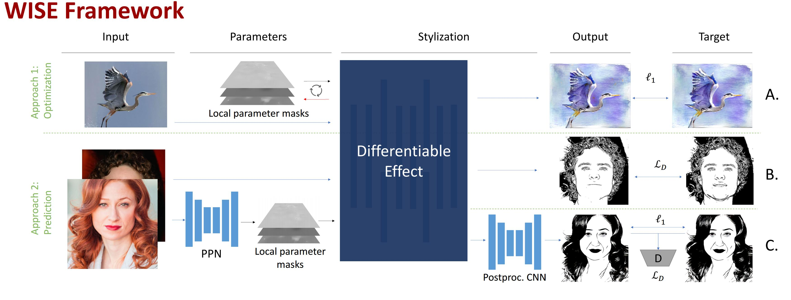
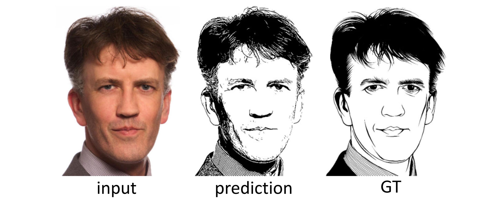
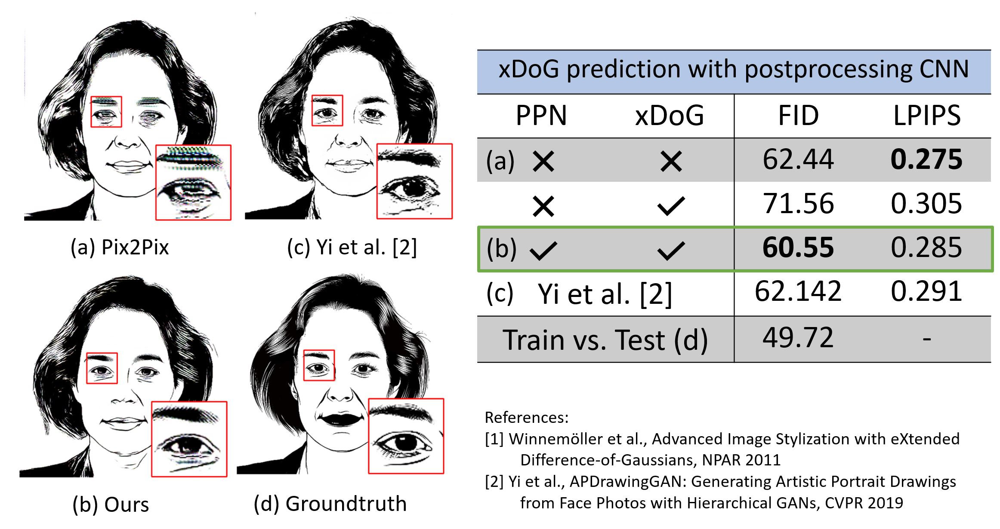

# Differentiable algorithmic stylization effects in Pytorch
### [Project Page](https://ivpg.hpi3d.de/wise) | [Video](https://youtu.be/GSVI26DDQrc) | [Paper](https://arxiv.org/abs/2207.14606) | [Poster](https://ivpg.hpi3d.de/wise/material/poster_eccv22.pdf)

Official Pytorch implementation of WISE, a framework for whitebox style transfer and image-to-image translation using algorithmic stylization effects.<br><br>
[WISE: Whitebox Image Stylization by Example-based Learning](https://ivpg.hpi3d.de/wise)  
 [Winfried Lötzsch](https://scholar.google.de/citations?user=wAVKdLcAAAAJ&hl=de)\*<sup>1</sup>,
 [Max Reimann](https://hpi.de/doellner/people/max-reimann.html)\*<sup>1</sup>,
 [Martin Büßemeyer](https://www.researchgate.net/profile/Martin-Buessemeyer)<sup>1</sup>,
 [Amir Semmo](http://asemmo.github.io/)<sup>2</sup>,
 [Jürgen Döllner](https://hpi.de/forschung/fachgebiete/computergrafische-systeme.html)<sup>1</sup>,
 [Matthias Trapp](https://hpi.de/doellner/people/trapp.html)<sup>1</sup> <br>
 <sup>1</sup>Hasso Plattner Institute, University of Potsdam, Germany, <sup>2</sup>Digitalmasterpieces GmbH, Germany<br/> 
  \*denotes equal contribution  
in ECCV 2022



Included are the introduced applications of differentiable algorithmic stylization effects using:

- Global Parameter Prediction
- Local Parameter Prediction
- Parameter Optimization (Parametric Style Transfer and checks for individual parameters)

We included the differentiable XDoG effect. 
Note that due to proprietary code, we can't include or open-source our Watercolor, Oilpaint and Toon effect implementation. 

Trained models can be downloaded from [google drive](https://drive.google.com/drive/folders/1WdRDw7-ivrpXNmbccMJ4HbtrV-zloD9o?usp=sharing), and put in the trained_models directory (see below).


## Global Parameter Prediction
Example call for prediction:
```
python -m global_ppn.train_and_test_parameter_prediction \
    --root_path . \
    --effect xdog \
    --gpus 0 \
    --test_npr \
    --task predict
```

Download the NPR portrait benchmark from [google drive](https://drive.google.com/drive/folders/1roLV3A8EIH2UAfTcfnR1jZVs6pJkLwMJ?usp=sharing) (original dataset can be found [here]a(http://users.cs.cf.ac.uk/Paul.Rosin/NPRportraitV01/)) and place it under experiments/nprp for tests on this dataset. The version from google drive includes parameter presets for xDoG (.pt files) for ground truth.

Example for training on hand-drawn references:
<p align="center">

</p>

Example call for training:
```
python -m global_ppn.train_and_test_parameter_prediction \
    --architecture multi_feature \
    --loss l1 \
    --bs 1 \
    --root_path . \
    --effect xdog \
    --gpus 0 \
    --num_workers 2 \
    --task train
```
For training, the root path should include 2 subfolders named ffhq_train, ffhq_val. Each containing training images.
See https://github.com/NVlabs/ffhq-dataset for download instructions.
Trained global models can be found under trained_models/global.


## Local Parameter Prediction
For testing our model on the APDrawing dataset, the pretrained generator needs to be placed at trained_models/ours_apdrawing/latest_net_G.pth. The options (no dropout, resnet convolution generator, using xDoG) must be set accordingly. The dataroot folder must point to the APDrawing dataset (see below for download instructions). 




Example call for test (our method on APDrawing dataset):
```
python -m local_ppn.test \
--dataroot <e.g. experiments/APDrawingDB/data/> \
--direction BtoA \
--model pix2pix \
--ppnG our_xdog \
--name ours_apdrawing \
--netG resnet_9blocks \
--no_dropout \
--load_size 576 \
--crop_size 512
```
Results and summary webpage will be generated in experiments/results/ours_apdrawing.

Example call for testing content-adaptive effects:
```
python -m tools.execute_local_ppn \
--file experiments/source/portrait.png \
--model trained_models/local/abstract_face_ts_model.pt
```
The results are placed in experiments/content_adaptive/.

Example call for training our method on APDrawing dataset:
```
python -m local_ppn.train \
--dataroot . \
--name apdrawing_xdog \
--model pix2pix \
--ppnG our_xdog \
--load_size 576 \
--crop_size 512
```
The ppnG option controls whether the XDoG stage should be used with random initial PPN parameters (our_xdog_random), ppn parameters initialized from imagenet (our_xdog) or a fixed preset should be used (our_xdog_none).
The dataroot should contain the APDrawing dataset, which can be obtained from [here](https://github.com/yiranran/APDrawingGAN) or here ([direct download](https://cg.cs.tsinghua.edu.cn/people/~Yongjin/APDrawingDB.zip)).
The code for local parameter prediction relies on the [Pix2Pix GAN implementation](https://github.com/junyanz/pytorch-CycleGAN-and-pix2pix), more info on training arguments can be found there.

## Parameter Optimization (in folder parameter_optimization)
### Parametric Style Transfer
Optimize parameter masks to fit the stylization generated by STROTTS style transfer. Results will be saved in experiments/result by default.
Example call:
```
python -m parameter_optimization.parametric_styletransfer \
    --effect xdog \
    --content experiments/source/portrait.png \
    --style experiments/target/xdog_portrait.png
```
This will generate the NST result (str_xx.png), the stylized image (OUT_xx.png) as well as a video of the optimization steps and a .pt file containing the parameter masks.
Use the CONFIG dict in parametric_styletransfer.py to set hyperparameters, e.g., to use global parameter optimization instead of locaal.

Note that due to its simplicity, the matching capability of xDoG is very limited in comparison to the watercolor effect (e.g., see supplemental video). Thus, a perfectly matching stylization will not be generated but rather the best possible approximation  within the expressivity of the effect.

Generated parameter masks can then be retouched using the provided webapp:
```
cd tools
streamlit run local_param_tune_app.py
```
Load the source (content) image first, and then the generated parameter mask. Select parameters, draw on the left image and see updates to the stylization in the right image. Press write changes to write to the parameter mask before changing parameters.

### Checks for individual parameters
Run check_individual_parameters to check gradients for individual parameters. Results will be saved in experiments/results/{effect-name}.
Example call:
```
python -m parameter_optimization.check_individual_parameters --effect xdog
```

## Disclaimer
The code for the parametric style transfer algorithm is provided by [David Futschik](https://github.com/futscdav/strotss). Find more details about the algorithm in the [original paper](https://arxiv.org/abs/1904.12785).

## Sources of images in experiments folder
- source/portrait.png and images in nprp: Rosin, Paul L., et al. "NPRportrait 1.0: A Three-Level Benchmark for Non-Photorealistic Rendering of Portraits." arXiv preprint arXiv:2009.00633 (2020).
- target/xdog_portrait: Yi, Ran, et al. "APDrawingGAN: Generating artistic portrait drawings from face photos with hierarchical gans." Proceedings of the IEEE/CVF Conference on Computer Vision and Pattern Recognition. 2019.
- target/watercolor_portrait: Dudu @Marek Yanai by CC BY-SA 4.0
